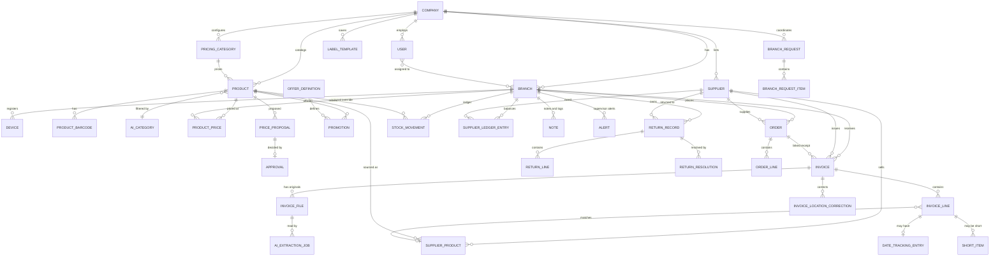

# Data model

Database: PostgreSQL. This document defines entities and rules, not exact column types; the AI developer finalizes migrations and records changes here.

## Conventions

- Primary keys: UUID. Every table has `created_at`, `updated_at`, `created_by` where a person acts.
- Every business table has `company_id`; branch-level tables also have `branch_id`. Enforce scoping in a shared base query layer and test it.
- Money: `Decimal(12,2)` for selling prices, invoice totals, ledger amounts; `Decimal(12,4)` for unit costs.
- No hard deletes. Use status/archived flags or void with a reason.
- Free text and names support `*_en` and `*_fa` columns (or a translations table). Custom notebooks require English and allow Persian to be empty, with an English display fallback; preserve both fields rather than manufacturing a translation.
- Use an append-only `audit_log` for sensitive actions.

## ERD (main relationships)



## Entities

### Tenancy, people, devices

| Entity      | Key fields and rules                                                                                                                                                                                                                                                                                                           |
| ----------- | ------------------------------------------------------------------------------------------------------------------------------------------------------------------------------------------------------------------------------------------------------------------------------------------------------------------------------ |
| `company`   | name, logo, default language, currency, timezone, settings                                                                                                                                                                                                                                                                     |
| `branch`    | company, name (en/fa), stable code/id, location_type (`store`/`warehouse`), sells_to_customers (Store default true, Warehouse false), address, phone, opening_hours, tax_region, active; warehouse cannot have Cashier access                                                                                                  |
| `user`      | company, name, **username** (unique per company), email (optional; needed only for a future Google sign-in), **one** role (`cashier`/`floor_worker`/`supervisor`), branches, `password_hash`, `must_change_password`, `password_changed_at`, `failed_attempts`, `locked_until`, active, created_by, last_login. No PIN fields. |
| `device`    | branch, name, registered_by, token hash, active (the store computer; enables the "recent users on this computer" list)                                                                                                                                                                                                         |
| `setting`   | company or branch scope, key, value (JSON)                                                                                                                                                                                                                                                                                     |
| `audit_log` | the History: actor, action, entity type/id, branch, before/after (JSON), device, timestamp, `reversible`, `reverted_by_entry`, `reverts_entry`, `undone`                                                                                                                                                                       |

### Catalog and pricing

| Entity                | Key fields and rules                                                                                                                                                                                                                                                                                                                                                                                                                                                                                                                                |
| --------------------- | --------------------------------------------------------------------------------------------------------------------------------------------------------------------------------------------------------------------------------------------------------------------------------------------------------------------------------------------------------------------------------------------------------------------------------------------------------------------------------------------------------------------------------------------------- |
| `pricing_category`    | key, label (en/fa), cost_divisor, rounding mode, apply_special_correction, taxable, date_tracking_prompt                                                                                                                                                                                                                                                                                                                                                                                                                                            |
| `tax_profile`         | key, label, rate (company-configured), `taxable` flag                                                                                                                                                                                                                                                                                                                                                                                                                                                                                               |
| `ai_category`         | name (en/fa), created by AI or person                                                                                                                                                                                                                                                                                                                                                                                                                                                                                                               |
| `product`             | code (unique per company, never reused, allocated beyond every previously assigned company code), name_en/fa, description_en/fa, unit_size, sold_by (`each`/`weight`, compatibility default each), date_tracking_preference (`yes`/`no`/unset), pricing_category, tax_profile, ai_category, status (`pending_approval`/`active`/`archived`), archived_at. Supervisor direct creation is immediately active; worker invoice proposals remain pending. Retain manual four-decimal cost/calculated-price provenance separately from an invoice source. |
| `product_barcode`     | product, barcode (unique per company; conflict → Approval)                                                                                                                                                                                                                                                                                                                                                                                                                                                                                          |
| `supplier`            | company, name, status (`proposed`/`confirmed`/`archived`), phone, email, address, sales_rep_name, sales_rep_phone, default_payment_terms, notes, proposed_by, confirmed_by, archived_by/at. Supervisor additions are confirmed; worker invoice quick-additions proposed. Deactivate archives without deleting history and excludes new-invoice choices. **Last delivery** per branch = latest `received_at` of that supplier's posted invoices in the branch (computed, or cached and refreshed on posting).                                        |
| `supplier_product`    | supplier, product (nullable until matched), supplier_sku, supplier_name, positive units_per_case, last_bought_unit_cost (4dp), last_bought_case_cost, last_bought_at, last_invoice_id/number, regular_cost_basis (excludes short-dated), quoted_unit_cost_before_tax?/quoted_by/quoted_at (separate expected-cost provenance), archived; manual edits and posted invoice snapshots retained                                                                                                                                                         |
| `product_price`       | product, branch (null = company default), selling_price, effective_from, source_proposal, price_origin (`rule`/`manual`), rule_price_snapshot, manual_actor/time; branch-specific manual provenance                                                                                                                                                                                                                                                                                                                                                 |
| `price_proposal`      | product, branch that triggered it, scope (`all`/`branch`), previous_price, proposed_price, unit_cost, cost_basis (invoice line), source_invoice_id (latest monetary basis), invoice_ids (retained merged evidence), reason (`calculated_change`/`new_product`/`manual_override`/`below_min_margin`/`tax_profile_change`), status (`pending`/`approved`/`rejected`/`superseded`), decided_by/at                                                                                                                                                      |
| `approval`            | generic Supervisor decision: type, target entity, status, decided_by, note                                                                                                                                                                                                                                                                                                                                                                                                                                                                          |
| `offer_definition`    | label ("2 for $5"), quantity, total price, pool key, price it belongs to (1.99/2.99/3.99), editable in settings                                                                                                                                                                                                                                                                                                                                                                                                                                     |
| `promotion`           | product, branch (null = same scope as the price), offer_definition, mix_and_match (bool), start (nullable), end (nullable), active, created_by                                                                                                                                                                                                                                                                                                                                                                                                      |
| `label_template`      | company, name ("Template 1"), width_mm, height_mm, margin_top/bottom/left/right, gap_x/y, offset_x_mm, offset_y_mm (calibration), slot_order (`ltr`/`rtl`), created_by. built_in_kind (`regular`/`promo`/null), rendering_style, archived. Add built-ins idempotently: Regular 60 × 40 mm/margins 10/gaps 4, Promo 210 × 148.5 mm/margins0/gaps0; retain editable geometry, originals and archived rows.                                                                                                                                            |
| `label_waitlist_item` | branch, product, copies, added_by, added_at, status (`waiting`/`printed`/`removed`), printed_at, printed_by. Shared per branch.                                                                                                                                                                                                                                                                                                                                                                                                                     |

### Receiving

| Entity                | Key fields and rules                                                                                                                                                                                                                                                                                                                                                                                                                                                                                                                                                                                                 |
| --------------------- | -------------------------------------------------------------------------------------------------------------------------------------------------------------------------------------------------------------------------------------------------------------------------------------------------------------------------------------------------------------------------------------------------------------------------------------------------------------------------------------------------------------------------------------------------------------------------------------------------------------------- |
| `invoice`             | branch (original receiving location), reviewer_origin_branch_id/assignment, ship_to_hint?, suggested_location?, supplier, supplier_invoice_number (nullable) + `number_is_system_assigned`, invoice_date, received_at, receiving_user, subtotal, tax, final_total, due_date?, payment_terms?, status (see workflows), blocked_reason?, posted_at/by                                                                                                                                                                                                                                                                  |
| `invoice_file`        | company/invoice, original filename, MIME type, page count, uploaded_by/time, storage key (S3 in production; retained browser data/blob in Phase 0), content hash/size. Originals are immutable; appended attachments keep actor/time and survive refresh. Demo image originals match immutable invoice snapshots, not placeholder text.                                                                                                                                                                                                                                                                              |
| `invoice_line`        | invoice, line_no, supplier_product (nullable), product (nullable), description, qty, unit (each/case), units_per_case, unit_cost_before_tax (4 dp), line_total, taxable flag, review_status (`needs_review`/`confirmed`), `date_tracking_required` (Yes/No/unset, initialized from explicit product preference and validated during review), line_status (`received`/`short`/`short_resolved`/`short_closed`/`refused`), entered_quantity_unit (`cases`/`units`), retained_pack_snapshot, normalized_units, manual_price_decision?, order_line_id?, discrepancy_decisions, short_dated (bool), expiry_discount_date? |
| `date_tracking_entry` | company/location/product, invoice_line optional (manual entries allowed), source (`invoice`/`manual`/`correction`), type (`expiry`/`best_before`), date, quantity? (evidence only), lot_number?, note?, status (`active`/`removed`), removal_reason (`sold_out`/`thrown_away`/`returned_to_supplier`/`entered_by_mistake`), removed_by/at, previous_entry/correction reference. One active snapshot per invoice line; preserve removed evidence and Undo audit.                                                                                                                                                      |
| `short_item`          | invoice_line, qty_short, deduction_before_tax, deduction_tax, status (`open`/`resolved_delivered`/`closed_not_delivered`), resolved_by/at, note                                                                                                                                                                                                                                                                                                                                                                                                                                                                      |
| `ai_extraction_job`   | invoice_file, status (`queued`/`processing`/`needs_review`/`failed`), provider, prompt/schema version, raw_json, error, cost                                                                                                                                                                                                                                                                                                                                                                                                                                                                                         |
| `alert`               | branch, type (`same_supplier_lower_price`/`other_supplier_price`/`cross_branch_price_conflict`/`tax_discrepancy`/`barcode_conflict`/`offer_suggestion`/`ai_failure`/`order_differences`/`return_credit_overdue`), payload (JSON, e.g. worker answers), status (`open`/`taken_care_of`/`pending`/`dismissed`), assigned role                                                                                                                                                                                                                                                                                          |

### Returns

| Entity              | Key fields and rules                                                                                                                                                                                                                                                                                  |
| ------------------- | ----------------------------------------------------------------------------------------------------------------------------------------------------------------------------------------------------------------------------------------------------------------------------------------------------- |
| `return_record`     | branch, supplier, status (`open`/`picked_up`/`partially_resolved`/`resolved`/`cancelled`), created_by, picked_up_at, supplier_rep_name (required at pickup), submitted_by, photo (optional), note                                                                                                     |
| `return_line`       | return, product/supplier_product, qty, reason, location note (e.g., walk-in cooler)                                                                                                                                                                                                                   |
| `return_resolution` | return, type (`credit_current_invoice`/`credit_later_invoice`/`replacement_received`/`cash_or_other`/`no_compensation`), invoice (for credits; a return is credited on at most one invoice), replacement lines (product, qty, date, employee, rep name, photo/note), `resolves` (`fully`/`partially`) |

### Physical movements, payables, notes (no Phase 1 stock projection)

| Entity                  | Key fields and rules                                                                                                                                                                                                                                                                                                                                                                       |
| ----------------------- | ------------------------------------------------------------------------------------------------------------------------------------------------------------------------------------------------------------------------------------------------------------------------------------------------------------------------------------------------------------------------------------------ |
| `stock_movement`        | branch, product, qty (signed), type (below), reference (invoice line / return line / note / count / product creation), occurred_at, user. Historical opening/count movements remain preserved, but Phase 1 accepts no new opening/stock-count entries and does not show their sum. Correction and transfer events retain original references.                                              |
| `stock_count`           | Deferred to separately paid inventory phase after register integration; no Phase 1 screen or transaction                                                                                                                                                                                                                                                                                   |
| `supplier_ledger_entry` | branch, supplier, type (`invoice`/`credit`/`payment`/`adjustment`/`opening_balance`), amount (signed), date, reference (invoice/return/supplier creation), cheque_number?, payment_date?, note, `disputed` flag. Payments may be partial. Each optional supplier opening balance is a distinct branch-scoped opening_balance dated as of the entered date and stamped with its Supervisor. |
| `notebook`              | company, branch (null = all branches), name_en (required)/name_fa (optional, fallback to English), kind (`to_order`/`store_use`/`for_supervisor`/`custom`), read_roles, add_roles (custom defaults Supervisor/Floor Worker), enabled_fields (product, quantity, date, measurement + unit), has_status, notify_supervisor, archived                                                         |
| `note`                  | notebook, branch, text, product (optional), qty (optional), date (optional), measurement + unit (optional), status, author, seen_by/at                                                                                                                                                                                                                                                     |

### Physical movement types (retained for future inventory)

`opening_count` (+, historical only; no new Phase 1 entry), `received` (+), `short_resolved_received` (+), `return_pending` (−, damaged set aside), `return_cancelled` (+), `replacement_received` (+), `store_use` (−), `adjustment` (±, historical count/correction events; new counts deferred), `sale` (− , Phase 2 only, posted by the register integration). C adds linked `transfer_sent`, `transfer_received` and `invoice_location_correction` events; C3 request Undo appends `transfer_correction` with `reverses_event_id` instead of deleting an event or claiming goods moved back. **Do not compute or display stock on hand in Phase 1.** Preserve historical opening/count/sale-ready schema; later paid inventory can enable projections after register sales. Never overwrite a physical event; add a correction.

## Invoice extraction JSON (AI output contract)

The AI reading step must return JSON validated against this schema; anything unreadable is `null` and flagged, never invented.

```json
{
  "supplier_name": "string|null",
  "supplier_invoice_number": "string|null",
  "invoice_date": "YYYY-MM-DD|null",
  "due_date": "YYYY-MM-DD|null",
  "payment_terms": "string|null",
  "branch_hint": "string|null",
  "subtotal": "decimal-string|null",
  "tax": "decimal-string|null",
  "final_total": "decimal-string|null",
  "lines": [
    {
      "line_no": 1,
      "supplier_sku": "string|null",
      "barcode": "string|null",
      "description": "string",
      "quantity": "decimal-string",
      "unit": "each|case|other",
      "units_per_case": "integer|null",
      "unit_cost_before_tax": "decimal-string|null",
      "line_total": "decimal-string|null",
      "taxable": "boolean|null",
      "confidence": "0..1",
      "needs_attention": "boolean"
    }
  ],
  "warnings": ["string"]
}
```

Matching order for each line: supplier SKU → barcode → AI/fuzzy name match against that supplier's history → otherwise propose a **new product**.

## Seed loading

`seed/arzon-config.json` is loaded by an idempotent management command: it creates the company, branches, roles' labels, pricing categories, bands, offer definitions, settings, and terminology. It must be safe to run repeatedly, and C authorizes idempotent company-scoped built-in Regular/Promo templates in the prototype. Existing saved/archived template edits are preserved; inserting built-ins does not reset geometry or recreate an archived template. The separately maintained backend seed command is outside the C prototype change scope.

## C receiving, orders and requests additions

| Entity                        | Key fields and rules                                                                                                                                                                                                                                                                                                                                                                                                                                                                                                                                                  |
| ----------------------------- | --------------------------------------------------------------------------------------------------------------------------------------------------------------------------------------------------------------------------------------------------------------------------------------------------------------------------------------------------------------------------------------------------------------------------------------------------------------------------------------------------------------------------------------------------------------------- |
| `received_entry`              | company, effective location projection, immutable source movement/invoice line, product, supplier, invoice number, actual cases/units with pack snapshot, occurred_at, received_by, receipt kind, correction references. A query view may derive it from retained physical receipt records; not a separate duplicate stock ledger. Exclude refused/voided delivery effects.                                                                                                                                                                                           |
| `supplier_item_price_history` | company, supplier_product, original invoice/line, original/effective location, bought_at/by, retained pack, case/unit cost before tax, actual received qty, short_dated/expiry flag; manual item additions without purchases have blank bought costs/date/invoice; explicit Supervisor quotes have separate quote provenance rather than fabricated purchase history. Regular basis excludes short-dated while actual last-bought/history includes it.                                                                                                                |
| `invoice_location_correction` | company, invoice, prior correction/version, from_branch_id, to_branch_id, actor/time/device, required reason, affected receipt/approval references, outstanding amount and allocation snapshot, paired supplier-ledger/physical correction IDs. Posted invoice is immutable; current effective location resolves the latest valid correction chain. Append-only, non-reversible.                                                                                                                                                                                      |
| `order`                       | company, branch/location, supplier, reference, status (`draft`/`ordered`/`partially_received`/`received`/`cancelled`), created/ordered/cancelled actor/time, expected_total_before_tax (Decimal), source_note_ids, linked_invoice_ids, version. No supplier ledger entry; `orders.allow_floor_worker` defaults false.                                                                                                                                                                                                                                                 |
| `order_line`                  | company, order, supplier item/product, bilingual name and supplier-code snapshot, units_per_case snapshot, ordered_cases, ordered_units, expected_case/unit_cost (required before placement; actual purchase or explicit quote/user-entered Expected unit cost, never silent catalog fallback), actually_received_units, cancelled_units, outstanding decision (`short`/`back_ordered`/`cancelled`), source note; free-text source notes require explicit supplier-item and Cases selection before placement. Posted receipts drive received quantities idempotently. |
| `order_invoice_decision`      | company, order, invoice/line or absent order line, difference kind (`short`/`not_delivered`/`extra`/`price_change`), previous/current quantities/costs and retained packs, explicit reviewer decision, actor/time; linked-invoice lower-cost answers appear in one consolidated order_differences alert rather than a duplicate lower-price alert. Refused extras excluded from payable/receipts; absent uninvoiced lines create no synthetic payable.                                                                                                                |
| `branch_request`              | company, from/requesting_branch_id, to/sending_branch_id, reference, status (`draft`/`requested`/`sent`/`received`/`closed`/`cancelled`), source_request_id?, each transition actor/time/location/device, reason?, version. Queries require access to one endpoint; actions require responsible endpoint.                                                                                                                                                                                                                                                             |
| `branch_request_item`         | company, request, product nullable or free_text, bilingual catalog snapshot/free-text as entered, quantity, quantity_unit (`units`/`cases`), pack snapshot when known, note, sent_qty, short_qty, received_qty, missing_qty, checkbox/decision states. Free text without a pack accepts positive whole Cases without invented case-to-unit conversion; fractional Cases require an explicit retained pack and exact whole normalized units.                                                                                                                           |

**Correction finance:** paired adjustments move only the invoice's current outstanding liability. Existing source payments/credits and allocations remain immutable; source outstanding closes and destination outstanding is projected from the correction. Preserve company/supplier/currency total and evidence. Future shorts/corrections resolve effective destination. Previously approved selling prices are not reapplied merely because an invoice location moved.

**Quantities and money:** all cost/expected/payable arithmetic uses Decimal; Each Units are positive whole; Weight quantities are positive kg/lb values with at most three decimals and retain source quantity/cost units; cases use exact Decimal positive quantity × positive integer pack and must normalize to positive whole units, with no float scaling/rounding. A fractional case is allowed only if this condition holds. Snapshot pack/cost on posted invoice/order so later supplier-item edits never alter history. Short-dated lots retain actual low-cost receipts/payable and Date tracking, but do not replace regular cost or create selling-price proposals.

**Receipt identity and corrections:** price comparisons use the accepted purchase history for the same supplier identity and supplier item, including supplier rename aliases; fully refused lines and another SKU are not price evidence. Uploaded and manual invoice lines remember a uniquely matched supplier item's pack without changing the original quantity or cost; ambiguous matches require review. Later Short deliveries identify the original invoice line, so two supplier codes for one product remain separate. Each order receipt retains its actual `receiving_branch`. After a posted invoice is moved, later delivery is authorized at its corrected location and History records that location, while original invoice/order locations and pack/cost snapshots remain unchanged.

## C3 preferences, undo and C4 retained records

| Record                              | Key fields and invariants                                                                                                                                                                                                                                                                                                                                                                      |
| ----------------------------------- | ---------------------------------------------------------------------------------------------------------------------------------------------------------------------------------------------------------------------------------------------------------------------------------------------------------------------------------------------------------------------------------------------- |
| `table_preference`                  | company/user/table key, hidden column IDs, defaults version; name/reference column mandatory; role-restricted money columns never selectable; Reset columns restores defaults. Browser storage permitted in Phase 0.                                                                                                                                                                           |
| `navigation_state`                  | company/user/list key, tab, filters, sort/page and scroll position; detail return/breadcrumb/browser Back restore it without broadening scope.                                                                                                                                                                                                                                                 |
| `request_transfer_event` correction | `kind=transfer_correction`, original `reverses_event_id`, request/endpoint/company/product/quantity, actor/time/reason; retains original physical evidence and means a recorded operation was corrected, not that goods physically returned.                                                                                                                                                   |
| `audit_log` additions               | affected-record snapshots/version expectations, inverse effect references, undo expiration (10 seconds), conflict result; action-scoped inverse preserves independent later changes. No posted invoice/payment/move/content correction is reversible. Actual request transfer evidence stays append-only.                                                                                      |
| `invoice_content_correction`        | company/invoice, original and previous correction/version IDs, effective location, required reason, actor/time/device, immutable before/after line snapshots (product/quantity/pack/cost/date/decisions), preview fingerprint, financial/physical/proposal/date/order impact refs. Confirmation rechecks version/allocation context; append-only, idempotent, non-reversible.                  |
| `invoice_line` weight additions     | sold_by snapshot, source quantity/unit (`kg`/`lb`), source cost/unit, case weight/unit when known, canonical lb quantity/cost, conversion-factor snapshot. Do not treat weight as whole Each units or change original posted evidence.                                                                                                                                                         |
| `supplier_product` weight additions | sold_by/quantity-unit snapshot, case_weight and case_weight_unit when used; distinct original last-bought source cost/unit and canonical pricing basis.                                                                                                                                                                                                                                        |
| `order_line` temporary additions    | line_kind (`supplier_item`/`new_item`), user-entered temporary name, optional retained pack/cost, explicit quantity, New item marker, resolved invoice_line/product/supplier_item IDs. Unresolved line is not a catalog product or purchase history; unique match/posted association is scoped and idempotent. Incomplete expected totals are identified as estimates with unknown components. |
| `return_memo`                       | company/location/return, unique stable RM reference, immutable pickup-time supplier/location/date/driver/employee/item/quantity/cost/expected-amount snapshots, printable bilingual content, signed-paper evidence reference. No confirmed credit implied.                                                                                                                                     |
| `return_record` additions           | expected_credit (Decimal), pending-credit projection enabled snapshot, pickup/memo reference, waiting-credit start, closure subtype (`credited`/`replaced`/`written_off`), credit-note number/actual amount or replacement receipt/invoice link or write-off reason; retained old statuses map to current UI, not deleted.                                                                     |
| `pending_return_credit`             | company/location/supplier/return/memo, projected expected amount, active/fulfilled/released outcome and references. Derived from retained claim evidence; distinct from posted supplier_ledger_entry credit. Reconciliation must avoid double deduction. Replacement releases the provisional expected credit; no new purchase/confirmed-credit ledger entry.                                  |

Corrected invoices resolve an append-only effective version for present-day document/Received/approval/date/financial projections. Original invoices, original files, payment/credit allocations and physical receipts remain addressable in History. Financial adjustment applies the difference exactly once; excess already allocated amounts remain explicit rather than disappearing. Receipt corrections do not fabricate a second delivery. Existing allocated settlements/downstream short/order/return decisions require impact validation, with unsupported conflicts blocked.

Pickup expected credit changes only the Supervisor payable projection. Confirmed ledger credits require authorized verification/evidence; a worker pickup must not impersonate a Supervisor financial posting. Credited replaces the pending expected amount with actual credit; Write off releases the projection. Old replacement evidence/coverage and safe-original recovery caps remain mandatory. Replacement releases the expected projection (owed $570 → $600), following the recorded owner answer in open-questions.

Seed pack correction is additive/versioned: realistic fixture packs and case representations preserve every prior invoice/ledger total. Preserve user-edited items, posted snapshots, custom settings/passwords and original records; do not overwrite a saved posted invoice merely to improve the starting demo. C3/C4 authorize seed/demo-data.json, seed/arzon-config.json and additional pricing cases within the allowed seed scope.
