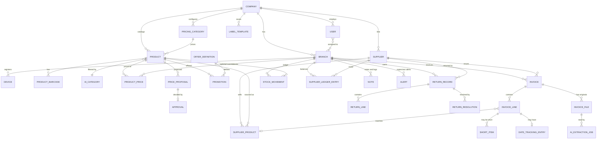

# Data model

Database: PostgreSQL. This document defines entities and rules, not exact column types; the AI developer finalizes migrations and records changes here.

## Conventions
- Primary keys: UUID. Every table has `created_at`, `updated_at`, `created_by` where a person acts.
- Every business table has `company_id`; branch-level tables also have `branch_id`. Enforce scoping in a shared base query layer and test it.
- Money: `Decimal(12,2)` for selling prices, invoice totals, ledger amounts; `Decimal(12,4)` for unit costs.
- No hard deletes. Use status/archived flags or void with a reason.
- Free text and names in two languages: `*_en` and `*_fa` columns (or a translations table). Do not store one language only.
- Use an append-only `audit_log` for sensitive actions.

## ERD (main relationships)


## Entities

### Tenancy, people, devices
| Entity | Key fields and rules |
|---|---|
| `company` | name, logo, default language, currency, timezone, settings |
| `branch` | company, name, code, address, active |
| `user` | company, name, **username** (unique per company), email (optional; needed only for a future Google sign-in), **one** role (`cashier`/`floor_worker`/`supervisor`), branches, `password_hash`, `must_change_password`, `password_changed_at`, `failed_attempts`, `locked_until`, active, created_by, last_login. No PIN fields. |
| `device` | branch, name, registered_by, token hash, active (the store computer; enables the "recent users on this computer" list) |
| `setting` | company or branch scope, key, value (JSON) |
| `audit_log` | actor, action, entity type/id, before/after (JSON), device, timestamp |

### Catalog and pricing
| Entity | Key fields and rules |
|---|---|
| `pricing_category` | key, label (en/fa), cost_divisor, rounding mode, apply_special_correction, taxable, date_tracking_prompt |
| `tax_profile` | key, label, rate (company-configured), `taxable` flag |
| `ai_category` | name (en/fa), created by AI or person |
| `product` | code (unique per company, never reused), name_en/fa, description_en/fa, unit_size, pricing_category, tax_profile, ai_category, status (`pending_approval`/`active`/`archived`), archived_at |
| `product_barcode` | product, barcode (unique per company; conflict → Approval) |
| `supplier` | company, name, status (`proposed`/`confirmed`/`archived`), phone, email, address, sales_rep_name, sales_rep_phone, default_payment_terms, notes, proposed_by, confirmed_by. **Last delivery** per branch = latest `received_at` of that supplier's posted invoices in the branch (computed, or cached and refreshed on posting). |
| `supplier_product` | supplier, product (nullable until matched), supplier_sku, supplier_name, units_per_case, last_cost, last_received_at |
| `product_price` | product, branch (null = company default), selling_price, effective_from, source_proposal |
| `price_proposal` | product, branch that triggered it, scope (`all`/`branch`), previous_price, proposed_price, unit_cost, cost_basis (invoice line), reason (`calculated_change`/`new_product`/`manual_override`/`below_min_margin`/`tax_profile_change`), status (`pending`/`approved`/`rejected`/`superseded`), decided_by/at |
| `approval` | generic Supervisor decision: type, target entity, status, decided_by, note |
| `offer_definition` | label ("2 for $5"), quantity, total price, pool key, price it belongs to (1.99/2.99/3.99), editable in settings |
| `promotion` | product, branch (null = same scope as the price), offer_definition, mix_and_match (bool), start (nullable), end (nullable), active, created_by |
| `label_template` | company, name ("Template 1"), width_mm, height_mm, margin_top/left, gap_x/y, created_by. **No seeded rows.** |

### Receiving
| Entity | Key fields and rules |
|---|---|
| `invoice` | branch, supplier, supplier_invoice_number (nullable) + `number_is_system_assigned`, invoice_date, received_at, receiving_user, subtotal, tax, final_total, due_date?, payment_terms?, status (see workflows), blocked_reason?, posted_at/by |
| `invoice_file` | invoice, storage key (S3), mime type, page count, uploaded_by. Originals are immutable. |
| `invoice_line` | invoice, line_no, supplier_product (nullable), product (nullable), description, qty, unit (each/case), units_per_case, unit_cost_before_tax (4 dp), line_total, taxable flag, review_status (`needs_review`/`confirmed`), `date_tracking_required` (bool, confirmed by a person), line_status (`received`/`short`/`short_resolved`/`short_closed`) |
| `date_tracking_entry` | invoice_line, type (`expiry`/`best_before`), date, lot_number?, status (`active`/`cleared`), cleared_by/at. One per invoice line. |
| `short_item` | invoice_line, qty_short, deduction_before_tax, deduction_tax, status (`open`/`resolved_delivered`/`closed_not_delivered`), resolved_by/at, note |
| `ai_extraction_job` | invoice_file, status (`queued`/`processing`/`needs_review`/`failed`), provider, prompt/schema version, raw_json, error, cost |
| `alert` | branch, type (`same_supplier_lower_price`/`other_supplier_price`/`cross_branch_price_conflict`/`tax_discrepancy`/`barcode_conflict`/`offer_suggestion`/`ai_failure`), payload (JSON, e.g. worker answers), status (`open`/`taken_care_of`/`pending`/`dismissed`), assigned role |

### Returns
| Entity | Key fields and rules |
|---|---|
| `return_record` | branch, supplier, status (`open`/`picked_up`/`partially_resolved`/`resolved`/`cancelled`), created_by, picked_up_at, supplier_rep_name (required at pickup), submitted_by, photo (optional), note |
| `return_line` | return, product/supplier_product, qty, reason, location note (e.g., walk-in cooler) |
| `return_resolution` | return, type (`credit_current_invoice`/`credit_later_invoice`/`replacement_received`/`cash_or_other`/`no_compensation`), invoice (for credits; a return is credited on at most one invoice), replacement lines (product, qty, date, employee, rep name, photo/note), `resolves` (`fully`/`partially`) |

### Stock, payables, notes
| Entity | Key fields and rules |
|---|---|
| `stock_movement` | branch, product, qty (signed), type (below), reference (invoice line / return line / note / count), occurred_at, user |
| `stock_count` | branch, product, counted_qty, expected_qty, variance, counted_by (creates an `adjustment` movement) |
| `supplier_ledger_entry` | branch, supplier, type (`invoice`/`credit`/`payment`/`adjustment`/`opening_balance`), amount (signed), date, reference (invoice/return), cheque_number?, payment_date?, note, `disputed` flag. Payments may be partial. |
| `note` | branch, type (`to_order`/`store_use`/`supervisor_note`), text, product (optional), qty (optional), status, author, seen_by/at |

### Stock movement types (the ledger)
`received` (+), `short_resolved_received` (+), `return_pending` (−, damaged set aside), `return_cancelled` (+), `replacement_received` (+), `store_use` (−), `adjustment` (±, from stock counts), `sale` (− , Phase 2 only, posted by the register integration). **Stock on hand = sum of movements per branch and product.** Never overwrite a quantity; always add a movement.

## Invoice extraction JSON (AI output contract)
The AI reading step must return JSON validated against this schema; anything unreadable is `null` and flagged, never invented.
```json
{
  "supplier_name": "string|null",
  "supplier_invoice_number": "string|null",
  "invoice_date": "YYYY-MM-DD|null",
  "due_date": "YYYY-MM-DD|null",
  "payment_terms": "string|null",
  "branch_hint": "string|null",
  "subtotal": "decimal-string|null",
  "tax": "decimal-string|null",
  "final_total": "decimal-string|null",
  "lines": [
    {
      "line_no": 1,
      "supplier_sku": "string|null",
      "barcode": "string|null",
      "description": "string",
      "quantity": "decimal-string",
      "unit": "each|case|other",
      "units_per_case": "integer|null",
      "unit_cost_before_tax": "decimal-string|null",
      "line_total": "decimal-string|null",
      "taxable": "boolean|null",
      "confidence": "0..1",
      "needs_attention": "boolean"
    }
  ],
  "warnings": ["string"]
}
```
Matching order for each line: supplier SKU → barcode → AI/fuzzy name match against that supplier's history → otherwise propose a **new product**.

## Seed loading
`seed/arzon-config.json` is loaded by an idempotent management command: it creates the company, branches, roles' labels, pricing categories, bands, offer definitions, settings, and terminology. It must be safe to run repeatedly, and it must **not** create label templates.
