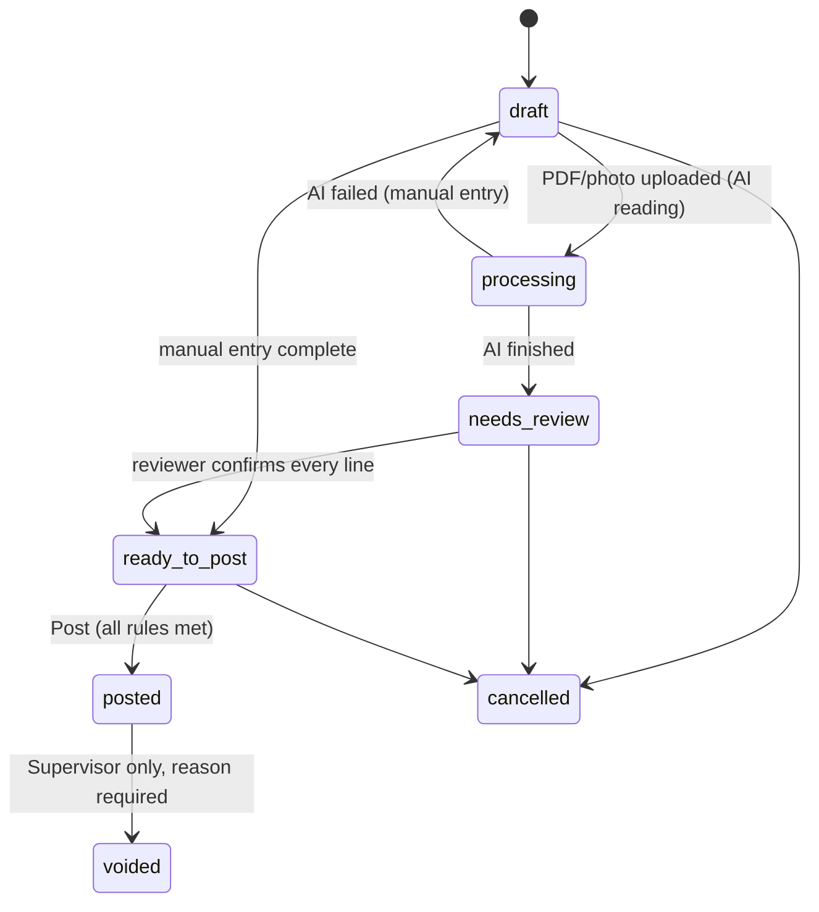
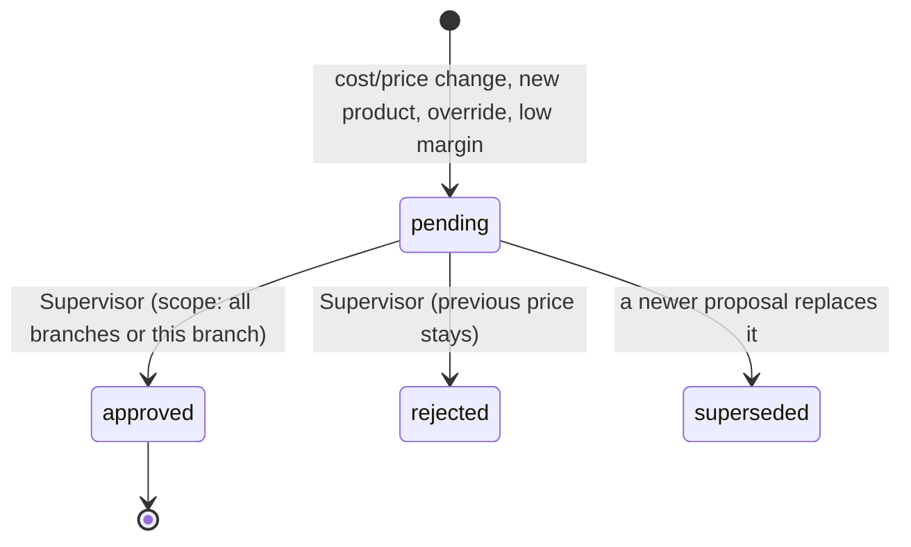
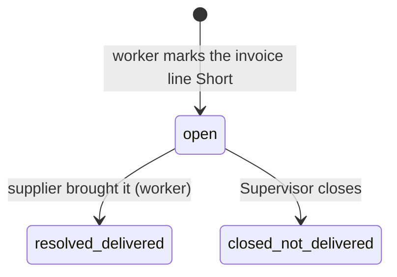
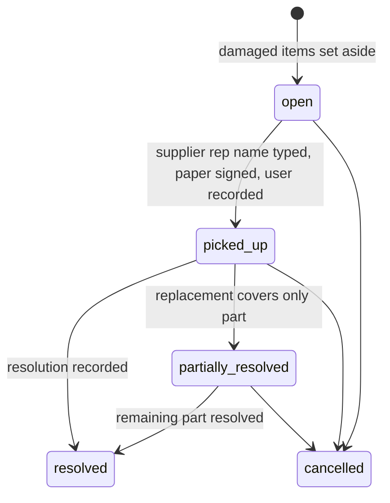
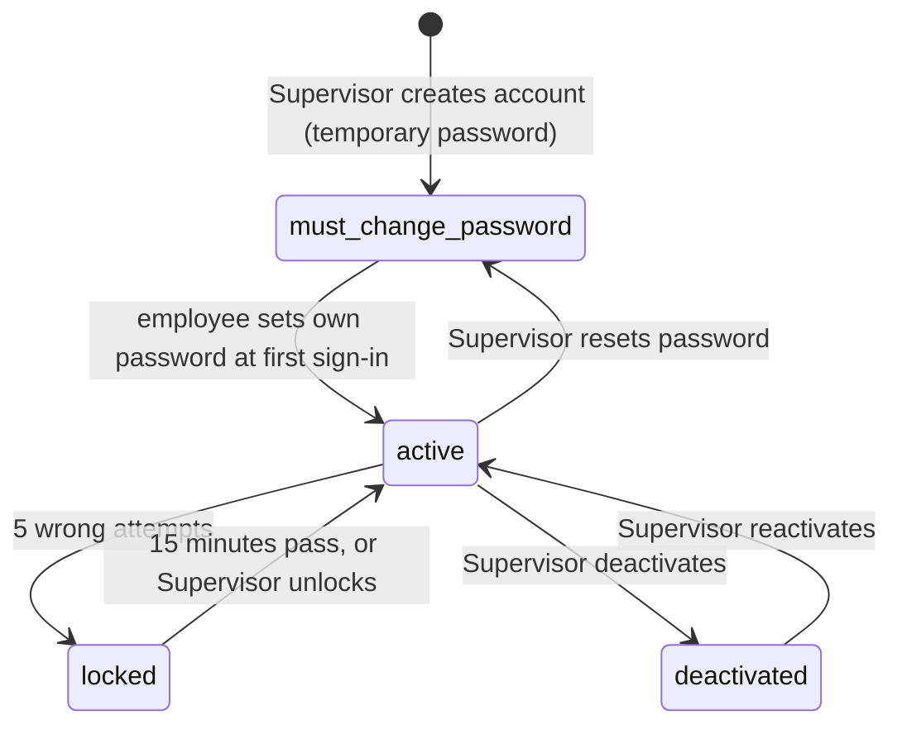

# Workflows and state machines

Each workflow lists states, who can move it, and the side effects. All state changes are audited.

## 1. Invoice

- **draft**: anything not yet submitted. Auto-saves. Allowed without the image/PDF. Listed in a "Drafts" tab like an email client.
- **processing**: AI is reading the file in the background; the worker can leave and come back.
- **needs_review**: AI lines wait for a person. The reviewer must confirm each line, including the explicit **Track date: Yes / No** decision for every line in A2.
- **ready_to_post**: header complete, original file attached, every line confirmed.
- **Posting rules** (all must hold): mandatory header fields present; original file attached; supplier is **confirmed** (a proposed supplier blocks posting with the reason shown as "Waiting for Supervisor to confirm supplier"); every unmatched line resolved (matched or created as a pending new product); worker has answered the same-supplier lower-price questions where they apply.
- **On posting:** create `received` stock movements for actually delivered quantities (exclude missing short quantities); create price proposals with this invoice/line's exact four-decimal cost, invoice number, posting employee and timestamp; create alerts; create the invoice entry in this branch's supplier ledger (net of open shorts); lock the invoice. Drafts/Ready to post previews create no active approvals. Posting stays blocked until every line has answered **Track date: Yes / No** and all category-specific required dates/decisions are valid.
- A posted invoice can be corrected only by the Supervisor (void and re-enter, or adjustment), always with an audit entry.
- Invoice number missing → assign next sequential number for that supplier and mark `number_is_system_assigned`.

## 2. New supplier

Floor Worker quick-adds a supplier (`proposed`) → invoice entry continues → invoice cannot be posted → Supervisor confirms (`confirmed`) or merges it into an existing supplier → invoice becomes postable. Dashboard shows "Supplier waiting for confirmation".

## 3. Price proposal and approval

- Triggers and approval rules are in `requirements.md` §6 and `pricing-engine.md`.
- While `pending`, the Products section shows the proposed price labeled **Pending** next to the approved price. The **cashier lookup keeps showing the last approved price as the price to charge**, with a small "New price pending" tag. A new product with no approved price shows its proposed price tagged "Pending: confirm with a Supervisor before selling". **(assumed)**
- Approval with scope **all branches** (default) sets the company default and clears branch overrides that this proposal replaces; **this branch only** creates/updates that branch's override.
- After a price becomes effective, run: offer suggestion check (§7) and cross-branch conflict check (§5).
- **Supervisor catalog edit (A2):** open the shared editor from Lookup/Products; validate permitted fields and immutable Product Code; if selling price changes, choose **All branches** (default) or **This branch only**, preview affected values, and save with the Supervisor manual-override decision. Retain original invoice-calculated value/number and append actor/date/scope/before/after provenance. Product edits append reversible History entries now; History UI and conflict-aware Revert wait for B. Worker invoice proposals still use their existing review/approval flow.

## 4. Same-supplier lower price (and different-supplier price)

Trigger (at invoice review/posting): the new unit cost of a supplier product is **lower** than that supplier product's last cost.

1. Ask the worker: **same expiry date as the stock on hand?**
2. **Yes** → ask: **how many units are left that were bought at the higher cost?**
3. **No** → ask for **both expiry dates** (old stock and new delivery).
4. Create an alert for the Supervisor with: item, supplier, old and new cost, worker's answers, invoice link.
5. Supervisor sets **Taken care of** or **Still pending** (can add a note, e.g., "credit requested").

Different supplier at a different price: the item is registered under that supplier (its own supplier name, SKU, pack size) and an alert `other_supplier_price` is raised with both suppliers' costs. Same Taken care of / Still pending actions.
This alert does **not** block posting and is independent of price approval (a cost drop may leave the selling price unchanged).

## 5. Cross-branch price conflict

- Trigger: after any price becomes effective, if a product's effective approved price differs between branches and there is no valid acknowledgment.
- Alert shows the product and each branch's price. Supervisor actions: **Mark as intentional** (stores the exact price pair; stays quiet until either price changes), **Apply price X to all branches**, or leave open.
- Differences are normal (different costs per branch); the alert is an awareness tool, never a blocker.

## 6. Short item

- **open**: the short amount (line amount plus proportional tax **(assumed)**) is deducted from the invoice's payable total in that branch's supplier ledger; no stock is added.
- **resolved_delivered**: add a stock movement, restore the amount to the payable total, record date and employee. If the delivered cost differs, run the normal price check.
- **closed_not_delivered**: the deduction stands as a credit; the Supervisor sees the invoice and the deducted amount.
- The Supervisor dashboard lists open shorts with age.

## 7. Offers and mix-and-match

- Offer definitions map selling price → offer (settings): 1.99 → 3 for $5, 2.99 → 2 for $5, 3.99 → 2 for $7 **(assumed)**.
- **Suggestion:** when a product's price becomes effective at one of those prices and the product has no offer in that scope, create an `offer_suggestion` task for the Floor Worker: **Confirm offer** (also choose whether it joins the mix-and-match pool) or **Dismiss**. No approval is needed after that.
- A product has at most one active offer per scope. Changing the price to one that maps to a different offer ends the old offer and creates a suggestion for the new one.
- Mix-and-match pools are per offer definition and global across categories and suppliers.
- Workers and Supervisors can also create and stop offers manually; start/end dates are optional.

## 8. Supplier return

- **A2 landing:** overview of all visible returns, default **Pending** (not resolved/cancelled), supplier default **All suppliers**, plus search/status/branch filters. A row opens its own return page, with creation employee/date, status and primary next action at the top. **Return policy** opens a centered dialog; lines and evidence/history use separate cards.
- When a supplier arrives and is selected, show that supplier's **open returns** at once so the worker can pick them up.
- Creating a return lines moves the damaged quantity out of sellable stock (`return_pending`). Cancelling puts it back (`return_cancelled`).
- Pickup requires the **supplier representative's typed name**. The paper copy carries the signature. Photo optional. Pickup does not require an invoice.
- Resolution types: credit on current invoice, credit on a later invoice, replacement product received (fully/partially), cash or other compensation, no compensation, cancelled.
- A return is credited on **one** invoice only. Linking the credit adds a `credit` entry to that branch's supplier ledger.
- **Replacement received** adds stock, records product/qty/date/employee/rep/photo/note, and **never** touches Payables.
- Completed and cancelled returns stay in history and are searchable.

## 9. Date tracking and expiry

- Every invoice line requires the reviewer's explicit **Track date: Yes / No** choice in A2. Grocery categories recommend tracking; Rice/Kitchenware default to No. A date entry is created only for Yes, with valid required fields. This replaces the former grocery-only confirmation interface without adding date quantities.
- "Expiring soon": date within the configured days (default 30). "Expired": date in the past, shown in red.
- Because there are no sales yet, the entry stays `active` until someone presses **Cleared** (removed, sold out, or checked).
- The list can be filtered by branch, AI category, and time window.

## 10. Labels: waitlist and printing

1. **Find products** in the label product list: search, or filter by Arrived today, Price changed recently, On offer, pricing category, AI category, supplier.
2. **Add to waitlist** (per product, with copies; or "Add all filtered"). The waitlist is shared per branch and survives sign-out and refresh. Optional setting: auto-add when a price is approved (off by default).
3. **Open the waitlist:** adjust copies, remove items, choose a saved **template** or create one (name, width, height, margins, gaps, calibration offsets).
4. The app calculates how many labels fit on an A4 sheet: `columns = floor((210 − left − right + gap_x) / (width + gap_x))`, `rows` likewise with 297; slots are numbered left-to-right, top-to-bottom (right-to-left setting for Persian layouts).
5. Choose the **starting slot** on the A4 preview (used slots shown grayed).
6. **Preview**, then **Print** (browser print dialog at exact size; "Save as PDF" works the same). Multiple pages are created when needed.
7. After printing, the app asks "Did the labels print correctly?" **Yes** removes the printed items from the waitlist and records the print in History; **No** keeps them.
8. **Test alignment page:** prints slot outlines only, so the user can hold it against a label sheet and adjust the template's calibration offsets.

## 11. Payables (Supervisor)

- Balance per **branch and supplier** = opening balance + invoices (net of open shorts) − credits − payments ± adjustments.
- Partial payments allowed; each payment can carry a cheque number and payment date; entries can be flagged **disputed** with a note.
- A month-end summary per supplier (printable, CSV) lists open invoices, credits, payments, and the balance.
- No QuickBooks integration now. Keep the export format simple and stable.

## 12. Stock counts

A worker selects a product, enters the counted quantity; the app shows expected vs counted, creates an `adjustment` movement for the difference, and logs it. Large variances appear in the Supervisor activity view **(threshold is a setting; default off)**.

## 13. Accounts and sessions

- **Create:** only the Supervisor (and the platform owner for the first Supervisor). Username unique per company; one role; branch(es); temporary password shown once.
- **First sign-in / after reset:** the only screen available is "Choose a new password"; the temporary password stops working immediately after.
- **Registered store computer:** "recent users on this computer" list → tap name → password. Other devices: username + password.
- **Idle lock:** after N minutes the screen locks; the same user unlocks with their password, or someone else signs in (which signs the first user out). No actions are possible while locked.
- **Sensitive actions** (approve, payables, settings, users) ask for the password again if it was last entered more than 15 minutes ago **(setting)**.
- Every sign-in, failed attempt, lock, reset, and deactivation is written to the audit log.

## 14. Notebooks

- Built-in notebooks (To order, Store use, For Supervisor) behave as in `requirements.md` §15.
- **Create/edit/archive notebook definition (Supervisor only):** name EN/FA, branch scope, read roles, add roles, optional fields, status on/off, notify Supervisor on/off → notebook appears in the Notes tabs for the allowed roles.
- **Add entry:** the fields the notebook enables; author, branch, and time are automatic.
- **Edit entry:** author within the undo window, Supervisor anytime (recorded in History).
- **Archive notebook:** hidden from tabs, entries stay searchable; can be restored.

## 15. History, undo, and revert

- Every action writes a History entry with before/after values and a `reversible` flag.
- **Undo window (B):** reversible simple actions show action text and an **Undo** link for **5 seconds** per toast; pause that toast's timer while hovered. Place bottom-left in English, bottom-right in Persian; stack newest first, at most three visible plus **+N more**, keeping independent timers. Undo restores the previous state and appends "Undone". A2 records reversible catalog edits but defers this interface to B; the prior 10-second rule is superseded.
- **Revert from History (Supervisor):** available on reversible entries; shows the before/after and asks for confirmation; creates a new entry "Reverted [action]". If the record changed again since then, show the conflict and do not overwrite silently.
- **Not reversible by undo/revert:** posted invoices, stock movements, payables entries, prints. These use corrections (`workflows.md` §1, §11) so the original stays visible.
- Examples: offer stopped by mistake → Undo, or Supervisor reverts → the offer is active again. Wrong product name → revert to the previous name. Price approved by mistake → revert restores the previous approved price (and creates a new price proposal history entry).
