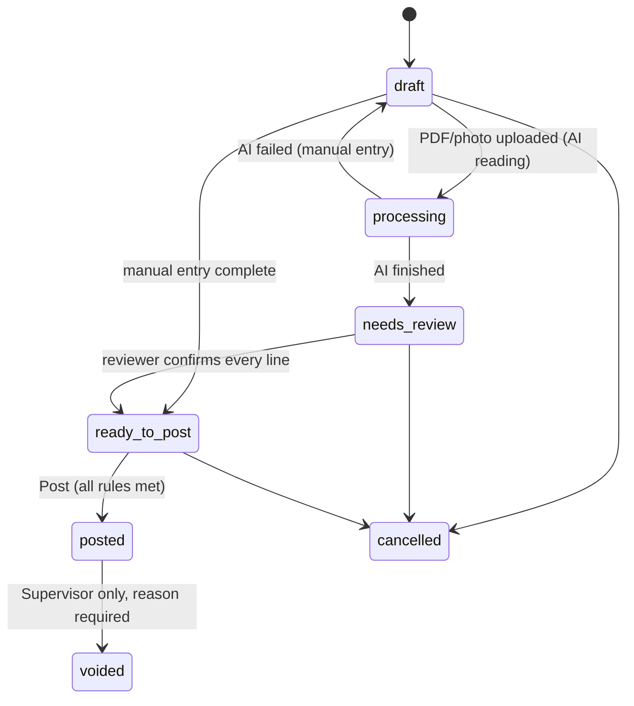
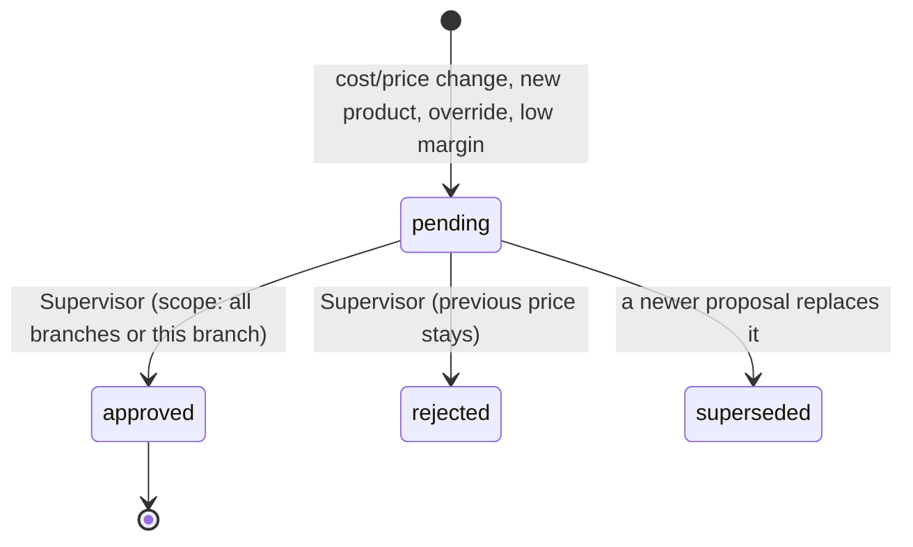
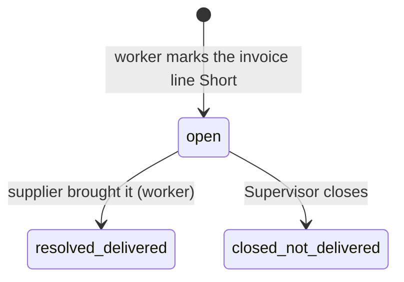
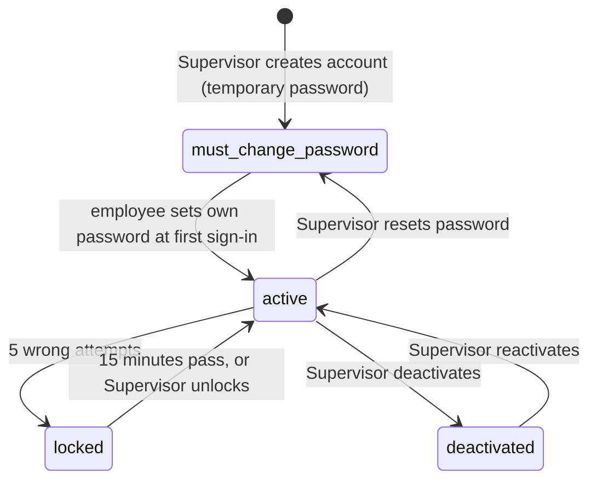

# Workflows and state machines

Each workflow lists states, who can move it, and the side effects. All state changes are audited.

## 1. Invoice

- **draft**: anything not yet submitted. Auto-saves. Allowed without the image/PDF. Listed in a "Drafts" tab like an email client.
- **Manual entry (B, item 46):** New invoice offers Upload and Manual entry side by side. Supervisor chooses the branch, supplier (including + Add supplier), supplier invoice number, invoice date and payment terms, then adds any product (including + Add new product), quantity and unit cost. Return from either shared add form selects the new record without discarding the draft. Manual entry uses the same pricing, lower-cost questions, date decisions, matching, tax and posting logic as uploaded review. Save as draft works without an original; Post still requires the original photo/PDF and all normal rules. No AI extraction or invented source document is needed for manual entry.
- **processing**: AI is reading the file in the background; the worker can leave and come back.
- **needs_review**: AI lines wait for a person. The reviewer must confirm each line. C4 initializes **Track date: Yes / No** from the product's explicit preference; unset still requires a choice, and Yes requires a valid type/date.
- **ready_to_post**: header complete, original file attached, every line confirmed.
- **Posting rules** (all must hold): mandatory header fields present; original file attached; supplier is **confirmed** (a proposed supplier blocks posting with the reason shown as "Waiting for Supervisor to confirm supplier"); every unmatched line resolved (matched or created as a pending new product); worker has answered the same-supplier lower-price questions where they apply.
- **On posting:** create `received` physical movements and Received log entries for actually delivered quantities (exclude missing short quantities); create price proposals with this invoice/line's exact four-decimal cost, invoice number, posting employee and timestamp; create alerts; create the invoice entry in this branch's supplier ledger (net of open shorts); lock the invoice. Drafts/Ready to post previews create no active approvals. Posting stays blocked until every line has a valid **Track date: Yes / No** value (initialized from an explicit product preference or answered by the reviewer), line confirmation and all required dates/decisions are valid.
- A posted invoice is a clean read-only document, corrected only by the Supervisor through **Correct invoice** or **Move invoice**, required reason, impact preview and confirmation; append linked corrections and preserve original/allocation/file evidence. No simple Undo or disabled draft editor.
- Invoice number missing → assign next sequential number for that supplier and mark `number_is_system_assigned`.

## 2. New supplier and manual supplier management

- **Supervisor Add supplier (B, item 44):** open from Suppliers or the invoice Supplier field's + Add supplier. The max-720 px shared form captures name, phone, email, sales rep/phone, payment terms, optional address/notes, and optional balance per allowed branch with an as-of date. A similar-name warning links to existing suppliers before save; it never silently merges. Save creates `confirmed` immediately and records actor/time/company in History.
- Each entered branch opening balance appends an `opening_balance` ledger entry labeled **Opening balance**, dated as of the entered date and attributed to the Supervisor. It appears in Payables; it is not an invoice, delivery or purchase-chart contribution. Existing ledger entries are never replaced.
- **Floor Worker invoice quick-add:** the same form has no opening-balance controls and creates `proposed`. Invoice entry continues but posting is blocked with **Waiting for Supervisor to confirm supplier** until the Supervisor confirms (`confirmed`) or explicitly merges it into an existing supplier. Dashboard shows Supplier waiting for confirmation. The transaction rejects unauthorized opening balances, including values supplied outside the UI.
- Only Supervisors can edit or deactivate suppliers. Deactivate excludes a supplier from new-invoice choices without deleting its invoices, returns, products, balances or history; existing records retain their links. Record every edit, confirmation and deactivation. Cashiers cannot add suppliers; Floor Workers have no standalone Suppliers Add supplier action.
- The supplier-confirmation task appears in Approvals and the Supervisor dashboard without price fields. Confirm supplier marks it Approved and releases the supplier posting gate. Reject marks the task Rejected and the proposed supplier inactive, retains its draft/history, and keeps posting blocked; it does not silently confirm or merge the supplier. Recheck a supplier snapshot before either decision so a stale preview cannot decide edited details. Record the signed-in Supervisor and decision time.

## 2A. Supervisor Add product and invoice product proposals

- **Supervisor Add product (B, item 45):** open the shared product editor in new mode from Products or an invoice's + Add new product. Capture English/Persian names, unit size, category, pricing category, barcode, supplier, date tracking, last unit cost before tax and selling price. No starting/opening counts in Phase 1.
- Compute selling price through the unchanged Decimal pricing engine using the entered cost/category. If the Supervisor changes the calculated selling price, record a manual override; if the saved price falls below the configured minimum margin, require the Supervisor's explicit confirmation. Do not invent invoice-number provenance for a manual cost.
- Allocate the next company-wide Product Code, beyond all previously assigned codes including archived records; a failed validation creates no product or movement. Block conflicting barcodes with the existing conflict flow and warn/link when a name is close to an existing product. Never silently merge products or recycle a code.
- Supervisor save creates an **Active** product immediately and records the creation/price decision in History; no separate pending-product approval is needed. C removes the starting-count fields/transactions. Preserve historical movement records and money corrections, never simple destructive Undo/Revert.
- **Floor Worker invoice-only + Add new product:** use the shared new form as a proposal, with no opening-count controls. Save a **Pending approval** product, retain normal invoice/posting-derived approval behavior and the last-approved-price rules. Floor Workers and Cashiers do not get a standalone Products Add product action; Cashiers cannot create invoice proposals. All state changes enforce role and company/branch scope.

## 3. Price proposal and approval

- Triggers and approval rules are in `requirements.md` §6 and `pricing-engine.md`.
- While `pending`, the Products section shows the proposed price labeled **Pending** next to the approved price. The **cashier lookup keeps showing the last approved price as the price to charge**, with a small "New price pending" tag. A new product with no approved price shows its proposed price tagged "Pending: confirm with a Supervisor before selling". **(assumed)**
- Approval with scope **all branches** (default) previews active selling locations, sets the company default and clears the selling-location overrides it actually replaces; **this branch only** updates a selling location's override. Non-selling Warehouse is excluded unless Sells to customers is enabled; keep original receiving source evidence.
- After a price becomes effective, run: offer suggestion check (§7) and cross-branch conflict check (§5).
- **Supervisor catalog edit:** open the shared editor from Lookup/Products; validate permitted fields and immutable Product Code; if selling price changes, choose **All branches** (default) or **This branch only**, preview affected values, and save with the Supervisor manual-override decision. Retain original invoice-calculated value/number and append actor/date/scope/before/after provenance. B adds History UI and conflict-aware Revert to the reversible records. Worker invoice proposals still use their existing review/approval flow; direct Supervisor creation uses §2A's immediate Active decision.

## 4. Same-supplier lower price (and different-supplier price)

Trigger (at invoice review/posting): the new unit cost of a supplier product is **lower** than that supplier product's last cost.

1. Ask the worker: **same expiry date as the stock on hand?**
2. **Yes** → ask: **how many units are left that were bought at the higher cost?**
3. **No** → ask for **both expiry dates** (old stock and new delivery).
4. Create an alert for the Supervisor with: item, supplier, old and new cost, worker's answers, invoice link.
5. Supervisor sets **Taken care of** or **Still pending** (can add a note, e.g., "credit requested").

Different supplier at a different price: the item is registered under that supplier (its own supplier name, SKU, pack size) and an alert `other_supplier_price` is raised with both suppliers' costs. Same Taken care of / Still pending actions.
This alert does **not** block posting and is independent of price approval (a cost drop may leave the selling price unchanged).

## 5. Cross-branch price conflict

- Trigger: after any price becomes effective, if a product's effective approved price differs between branches and there is no valid acknowledgment.
- Alert shows the product and each branch's price. Supervisor actions: **Mark as intentional** (stores the exact price pair; stays quiet until either price changes), **Apply price X to all branches**, or leave open.
- Differences are normal (different costs per branch); the alert is an awareness tool, never a blocker.

## 6. Short item

- **open**: the short amount (line amount plus proportional tax **(assumed)**) is deducted from the invoice's payable total in that branch's supplier ledger; no Received quantity is recorded.
- **resolved_delivered**: record an actual received movement, restore the amount to the payable total, record date and employee. If the delivered cost differs, run the normal price check.
- **closed_not_delivered**: the deduction stands as a credit; the Supervisor sees the invoice and the deducted amount.
- The Supervisor dashboard lists open shorts with age.

## 7. Offers and mix-and-match

- Offer definitions map selling price → offer (settings): 1.99 → 3 for $5, 2.99 → 2 for $5, 3.99 → 2 for $7 **(assumed)**.
- **Suggestion:** when a product's price becomes effective at one of those prices and the product has no offer in that scope, create an `offer_suggestion` task for the Floor Worker: **Confirm offer** (also choose whether it joins the mix-and-match pool) or **Dismiss**. No approval is needed after that.
- A product has at most one active offer per scope. Changing the price to one that maps to a different offer ends the old offer and creates a suggestion for the new one.
- Mix-and-match pools are per offer definition and global across categories and suppliers.
- Workers and Supervisors can also create and stop offers manually; start/end dates are optional.

## 8. Supplier return (C4 presentation and claim lifecycle)

Open tab: **Waiting for pickup → Waiting for credit**. History: **Closed** (Credited/Replaced/Written off) or **Cancelled**. Map retained old statuses and partial replacement evidence into these labels; preserve actual uncovered quantities and audit trail. Return page keeps policy/evidence cards, creation metadata and Back to Returns. Supplier Returns tab shares this workflow.

1. Create return once; record actual set-aside and reasons, no stock projection. Supplier selection shows visible open returns immediately.
2. **Record pickup** validates actual items, required typed representative name, signed-paper evidence and employee/time; no invoice needed. Retain a bilingual **Return memo RM-0001** with header/items/quantity/unit-cost/expected-credit/driver/signature. Print/Download retains exact paper geometry and does not create a second physical or monetary event.
3. Setting **Deduct expected credit at pickup** (On) derives a Supervisor-only pending-credit projection: ledger owed $600 less expected $30 = displayed $570 owed, $30 Pending credit. Pickup is not a confirmed supplier credit; no worker financial posting. Retry creates neither duplicate projection nor memo.
4. **Credited:** Supervisor validates credit-note number/actual amount/evidence and existing single-credit/allocation caps; remove the expected projection and apply actual credit once. Expected30/actual25 makes owed $575; missing $5 returns to owed. Worker may submit evidence only.
5. **Replaced:** link real replacement receipt/invoice, preserve actual product/coverage/quantity/employee/evidence; no payable purchase or confirmed credit created. Partial coverage remains waiting with actual remainder. Owner confirmed: release its expected-credit projection when replaced, restoring projected owed $570 → $600. No new purchase payable or confirmed credit is posted.
6. **Written off:** Supervisor records required reason, releases pending projection and restores owed amount, with immutable outcome/evidence. No fabricated physical recovery.
7. **Cancelled:** follow return-policy safe-original rules, retain originals/replacements/settlements. Worker can cancel unsettled operational record; settled/financial reversal needs Supervisor review. A cancel is not proof that the goods came back.
8. Alert Supervisor once when credit wait exceeds configured 14 days, using pickup/outstanding-claim age; update/resolve the alert on outcomes. History remains searchable. No Returned to stock column.

## 9. Date tracking and expiry (C4)

1. Initialize invoice Track date from product Yes/No; ask only if unset. Yes requires type/date. Confirm the line normally; short-dated expiry remains mandatory independently.
2. **Add date** from Date tracking/Lookup/Products chooses product, concrete allowed location, Expiry/Best before/date and optional quantity/lot/note; creates a scoped manual entry with actor/time. Does not create stock or money.
3. The next active scoped date appears on Lookup/Products. Expiring soon uses default 30-day setting; expired is a problem pill.
4. **Remove** requires Sold out/Thrown away/Returned to supplier/Entered by mistake; append removed state/reason/actor/time with Undo. Removed filter exposes retained evidence. No automatic stock movement or return credit.
5. Supervisor **Stop tracking this product** sets preference No and explicitly chooses whether to remove its open dates. If kept, existing dates stay active. Enabling preference in Edit product offers Add a date now. Undo/Revert is scoped and conflict-aware.

## 10. Labels: waitlist and printing

1. **Find products** in the label product list: search, or filter by Arrived today, Price changed recently, On offer, pricing category, AI category, supplier.
2. Select product checkboxes or **Select all filtered**; the sticky selection bar sets a shared copy count and **Add N products to waitlist**. Individual copy changes are in Waitlist only. The waitlist is shared per branch and survives sign-out and refresh. Optional setting: auto-add when a price is approved (off by default).
3. **Open the waitlist:** adjust copies, remove items, choose a saved **template** or duplicate/edit a built-in **Regular / Promo** template, or create one (name, width, height, margins, gaps, calibration offsets). Archive/restore rather than delete; built-ins are inserted once without resetting existing templates.
4. The app calculates how many labels fit on an A4 sheet: `columns = floor((210 − left − right + gap_x) / (width + gap_x))`, `rows` likewise with 297; slots are numbered left-to-right, top-to-bottom (right-to-left setting for Persian layouts).
5. Choose the **starting slot** on the A4 preview (used slots shown grayed).
6. **Preview**, then **Print** (browser print dialog at exact size; "Save as PDF" works the same). Multiple pages are created when needed.
7. After printing, the app asks "Did the labels print correctly?" **Yes** removes the printed items from the waitlist and records the print in History; **No** keeps them.
8. **Test alignment page:** prints slot outlines only, so the user can hold it against a label sheet and adjust the template's calibration offsets.

## 11. Payables (Supervisor)

- Confirmed ledger balance per **location and supplier** = opening balance + invoices (net of open shorts) − confirmed credits − payments ± adjustments. Displayed owed additionally subtracts separately labeled active provisional return credits when the pickup setting is On; never count both expected and confirmed credit for one settlement.
- Partial payments allowed; each payment can carry a cheque number and payment date; entries can be flagged **disputed** with a note.
- A month-end summary per supplier (printable, CSV) lists open invoices, credits, payments, and the balance.
- No QuickBooks integration now. Keep the export format simple and stable.

## 12. Deferred inventory

Phase 1 has **no inventory system**: no Stock page, on-hand estimate, opening count, stock-count form or variance dashboard. Retain physical receiving/return/transfer events for a separately paid later inventory phase after register sales. Do not change historical movements merely because their stock projection is hidden.

## 13. Accounts and sessions

- **Create:** only the Supervisor (and the platform owner for the first Supervisor). Username unique per company; one role; branch(es); temporary password shown once.
- **First sign-in / after reset:** the only screen available is "Choose a new password"; the temporary password stops working immediately after.
- **Registered store computer:** "recent users on this computer" list → tap name → password. Other devices: username + password.
- **Idle lock:** after N minutes the screen locks; the same user unlocks with their password, or someone else signs in (which signs the first user out). No actions are possible while locked.
- **Sensitive actions** (approve, payables, settings, users) ask for the password again if it was last entered more than 15 minutes ago **(setting)**.
- Every sign-in, failed attempt, lock, reset, and deactivation is written to the audit log.

## 14. Notebooks

- Built-in notebooks (To order, Store use, For Supervisor) behave as in `requirements.md` §15.
- **Create/edit/archive notebook definition (Supervisor only):** English name required/Persian optional with English fallback, branch scope, read roles, add roles, optional fields, status on/off, notify Supervisor on/off → notebook appears in the Notes tabs for the allowed roles.
- **Add entry:** the fields the notebook enables; author and time are automatic, and the entry always has a concrete allowed location. In All branches, Supervisor sees a styled location picker and can add. New custom notebooks allow Supervisor/Floor Worker read/add by default. Explain archived/read-only/no-allowed-location/outside-scope blockers; never silently hide the form.
- **Edit entry:** author within the undo window, Supervisor anytime (recorded in History).
- **Archive notebook:** hidden from tabs, entries stay searchable; can be restored.

## 15. History, undo, and revert

- Every action writes a History entry with before/after values and a `reversible` flag.
- **Undo window (C3):** action name and **Undo** for **10 seconds**, bottom-right English/bottom-left Persian, above all interface layers. Pause hovered/focused toast independently; stack newest-first, at most three visible plus +N more. Coverage: approve/reject, waitlist add/remove, notes add/edit/archive/ordered, offers create/stop, dates add/remove, draft order save/cancel, request steps, supplier-item edits and settings. Preserve later unrelated changes; check company/role/location/record versions and block stale/conflicting inversion.
- Undo request actions appends `transfer_correction` with `reverses_event_id` and retains original operational/physical evidence; never deletes sent/received events or invents recovery. Place order/source-note mark ordered may Undo only before any receipt/later edit, retaining reference and audit evidence. Money/legal actions (Post invoice, payment, Move invoice, Correct invoice) use confirmation then subsequent corrections, never Undo.
- **Revert from History (Supervisor):** available on reversible entries; shows the before/after and asks for confirmation; creates a new entry "Reverted [action]". If the record changed again since then, show the conflict and do not overwrite silently.
- **Not reversible by undo/revert:** posted invoices, stock movements, payables entries, prints. These use corrections (`workflows.md` §1, §11) so the original stays visible.
- Examples: offer stopped by mistake → Undo, or Supervisor reverts → the offer is active again. Wrong product name → revert to the previous name. Price approved by mistake → revert restores the previous approved price (and creates a new price proposal history entry).

## 1A. Invoice receiving location and posted relocation (C1)

- New invoice defaults to user's own concrete allowed location; Supervisor uses the current concrete location when their account spans all locations, otherwise first active allowed location. Ship-to evidence suggests a matching active location but requires reviewer confirmation. Retain reviewer origin location/assignment on a draft. An authorized handling reviewer can change its receiving location to any active same-company Store/Warehouse and still finish that draft; this does not grant access to unrelated records at the destination.
- Posted invoice remains immutable. Supervisor chooses **Move invoice**, destination and required reason; preview received entries, pending approvals and current outstanding financial liability. Recheck the original effective location/record version and allocation snapshot before saving; same-location, foreign-company, inactive-target, stale and repeated correction attempts add nothing.
- Append `invoice_location_correction` with original invoice, from/to locations, actor/time/device/reason and affected references. Effective-location queries resolve correction chains for invoice display, Received, product Last received, supplier tabs, short/date entries and source-linked approval location. Preserve original posted header and receipt references. Record paired movement-location corrections; never fabricate a second delivery.
- Transfer **current outstanding liability**, after existing shorts/adjustments and allocated payments/credits, with paired source/destination supplier-ledger corrections. Keep historical payments/credits and their original allocations where recorded, with the impact shown in preview; never replay money. Source outstanding becomes zero and destination outstanding becomes the exact prior remainder. Company total, currency, supplier, actual invoice totals and payment evidence are conserved, even for fully paid invoices whose receipts still move. Future short deliveries and invoice corrections use the effective destination.
- Append non-reversible History for the correction; another move is another correction, never edit/delete/Undo of the original. Pending approval effective origin follows its **latest monetary cost-basis source invoice** (`source_invoice_id`, with retained invoice number/posted timestamp compatibility). Merged approval `invoice_ids` are historical evidence: moving an older linked invoice cannot redirect the latest proposal or split/replay money. Approved global/branch price decisions are not silently reapplied to a different branch.

## 16. Manual-price receipt decisions (C1)

An effective manual price stays approved when a new invoice changes cost. Show rule/manual prices and require **Keep manual price / Use rule price** before line confirmation. Keep updates regular cost provenance but retains manual selling price; evaluate configured minimum margin using that actual manual price/new cost and keep a deduplicated below-margin review when needed (current price remains, manual flag stays). Use records review intent and creates normal posting-time Supervisor approval even if rule price equals manual price, so explicit approval can clear manual provenance; approved manual price remains until that proposal is approved. Reject preserves it. Supervisor-only margins follow existing visibility. A short-dated lot bypasses repricing and retains both regular basis and manual flag.

## 17. Orders and receipt reconciliation (C2)

1. Supervisor (or explicitly enabled Floor Worker) selects allowed location and active confirmed supplier; add supplier items with pack/last-price snapshots and positive cases. Save draft or Place order with expected before-tax Decimal total. `orders.allow_floor_worker` defaults false; opt-in grants order cost snapshots/expected amounts only inside Orders, not Supplier cost-history/catalog access. Units must be positive whole; fractional Cases require an integer retained pack with exact positive whole converted units (0.5 × 12 = 6), using Decimal without float rounding. A manually added supplier item without purchase evidence displays no bought cost/date/invoice; require explicit Expected unit cost before placement unless an actual purchase or separately marked Supervisor quote supplies it. No hidden catalog-cost fallback. A source To order note is linked and becomes ordered only when the order is placed. Free-text notes without a catalog match require explicit supplier-item selection or intentionally created New item line and Cases quantity before placement; never invent their product, pack or quantity. Print order is a bilingual A4 operational sheet; no Payables entry.
2. Ordered/Partially received orders can be suggested only on invoices with the same company, supplier and effective receiving location. Explicitly link; changing invoice supplier/location invalidates incompatible links/decisions and returns their blockers.
3. Normalize case/unit quantities using each retained pack. As ordered is OK; partial invoiced delivery uses existing Short flow. Order line absent from invoice requires **Short / Back-ordered / Cancelled**, without inventing an invoice payable/deduction. If an order expects 4 cases but the invoice bills/delivers 3, classify the retained remaining 1 case as Short/Back-ordered/Cancelled without deducting an uninvoiced amount. Retain line comparison snapshots. Extra line requires **Keep it (we pay for it) / Refused / sent back with the driver**; refused quantities are removed from payable and Received using original proportional tax conservation and cannot create regular-cost/price approvals. Cost differences show old/new and require decision.
4. Lower cost offers **Short-dated (expiry discount)** plus existing same-supplier explanations. Short-dated requires expiry date; on posting create Date tracking and actual discounted receipt/payable but no regular-cost update, selling-price change or price-change approval. Supervisor may separately create clearance offer/Promo print.
5. Every difference needs its decision before Post; original/supplier/date/matching/line gates remain. Posting once updates order cumulative actually received quantities and remaining decisions, records invoice link, and creates one Supervisor alert summarizing all differences. Linked invoices retain regular lower-cost answers inside this consolidated alert, without a second lower-price alert; unlinked invoices retain their existing alerts. Retry cannot create duplicate order receipts, delivery entries, approvals, money or alerts.
6. Draft → Ordered → Partially received → Received, or Cancelled. Complete actual deliveries or explicitly cancelled residual quantities close an order; unresolved Short/Back-ordered remains partial/open. Preserve all previous partial deliveries and receipt links. Order itself never changes supplier balance or stock.

## 18. Branch request lifecycle (C2)

- Requester (Supervisor/Floor Worker) at a concrete allowed location creates Draft to another active same-company Store/Warehouse (request destination may differ from the requester's assigned location; this grants no unrelated destination records) with catalog/free-text items, Units/Cases, positive quantity and optional notes; send → Requested. Free-text Cases without a pack must be positive whole Cases, with no invented unit conversion; fractional Cases require an explicit retained integer pack and exact whole normalized units. Cashier cannot read or act.
- Sending-location actor sees Incoming checklist, ticks quantities sent or records Short; **Mark as sent** → Sent. Printing a bilingual picking list changes no state. Requester sees Outgoing; actor at requesting location records actual arrivals or Missing, then **Mark as received** → Received; retain missing annotations, then **Close request** → Closed. Cancel is allowed only for Draft/Requested and retains original/reason/evidence. Once Sent, record actual receiving/missing and close; do not cancel away physical transfer evidence.
- Endpoint role/location permissions are checked on every transition, not only menu visibility. Supervisor explicitly selects the acting endpoint. Stale/repeated/out-of-order transitions fail atomically. Requests at one endpoint do not expose unrelated records from another company/location.
- Actual sent/received quantities produce linked physical transfer events for later inventory only, with distinct from/to locations and request references; no stock balance or Payables mutation. Received quantity never exceeds sent; short/missing partial quantities remain documented. **Copy short or missing items** creates a new linked Draft containing just residual quantities; preserve original, never silently send the new draft.

## 19. Correct a posted invoice (C4)

Supervisor opens the readable effective invoice → **Correct invoice** → populated current lines → edit quantity/cost/product/pack/date and required reason → preview payable delta, Received effects, affected pending approvals and Date tracking → confirm. Revalidate invoice/correction version, scope and downstream allocation/short/order/return context before atomic save. Unsupported downstream conflicts block with a precise fix path.

Append an immutable correction version and compensating references; preserve original header/lines/file, actor/reason/time and allocated payment/credit history. Apply only the delta at effective location, once; do not replay original payable/delivery/order receipts or automatically reapply approved selling prices. Replace/supersede eligible source pending proposals and date projections while retaining prior evidence. If corrected liability falls below allocated payments/credits, retain excess explicitly unapplied/corrective, not erased. Show **Corrected** and both original/current versions in History. Another correction is another version, not a mutable overwrite. Confirmation is required; Undo is absent.

## 20. New item order association and source documents (C4)

Create a temporary **New item** order line using a typed name, explicit Cases quantity, optional pack/expected cost; preserve missing estimate metadata openly, no silent catalog fallback. Print the New item pill and whole A4 page with aligned bilingual Cases/Units headings. New order table uses available desktop width and phone item cards.

Link same-company/supplier/location invoice → explicitly choose which actual invoice line fulfills each temporary line → match/create actual product under normal receiving permissions → resolve discrepancies and confirm normal line requirements → Post once. Only posting creates the supplier-item association and links the temporary line/receipt; draft linking does not invent bought history. Repeated or conflicting associations fail atomically. All existing absent/short/refused/price/short-dated reconciliation remains.

Original upload is retained with invoice across refresh, including posted/corrected views. Image fit/zoom and PDF page navigation/Download use the actual bytes. Manual no-file state exposes Attach original; posting gate unchanged. Demo images have matching fictional header/bill-to/line-packs/subtotal/tax/total and no .txt placeholder. Realistic fixture packs/case quantities preserve all prior monetary totals and saved posted evidence.
