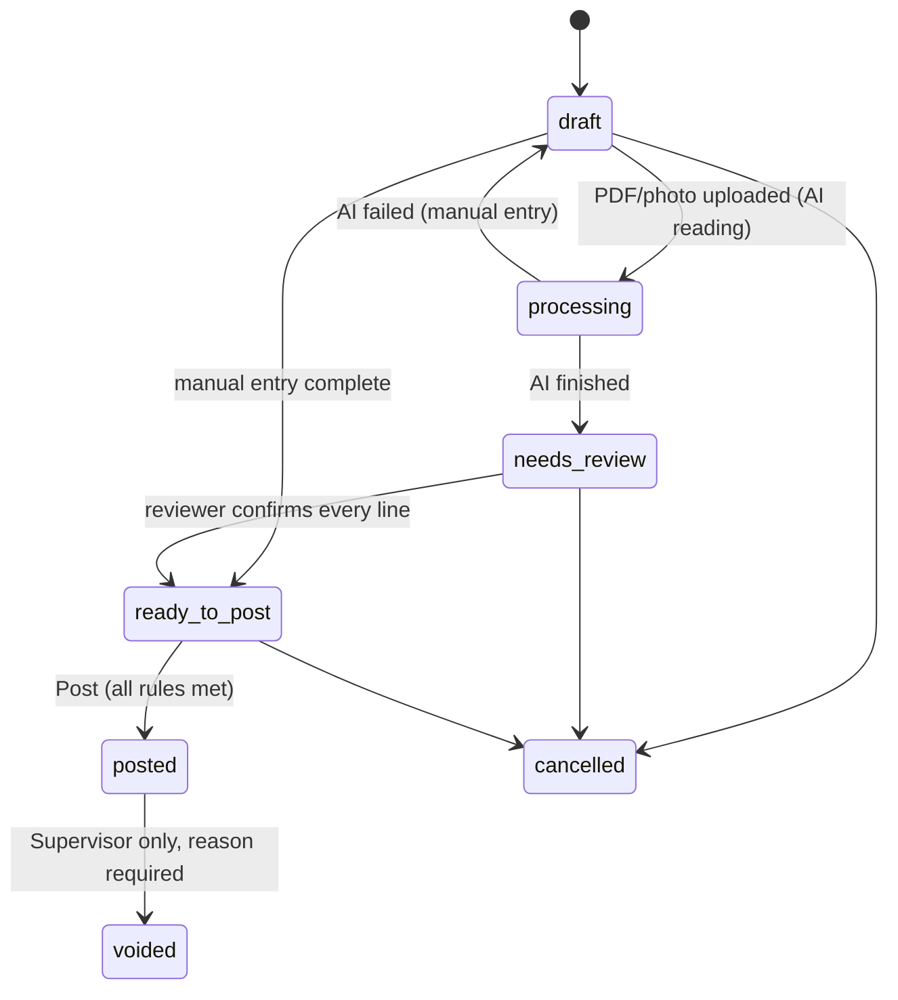
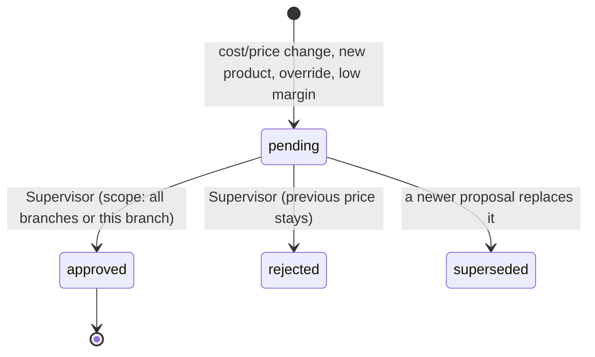
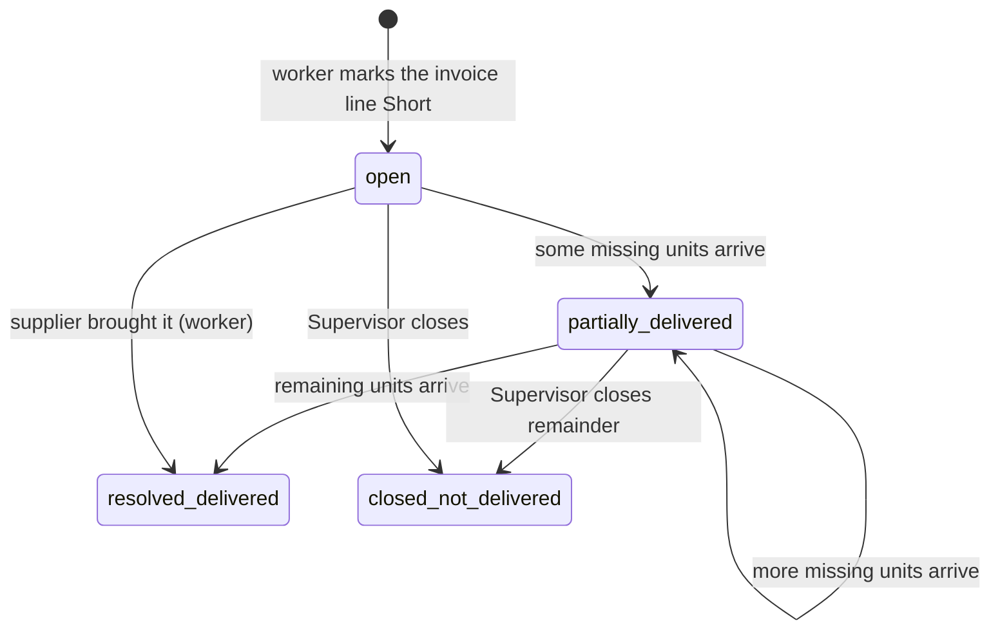
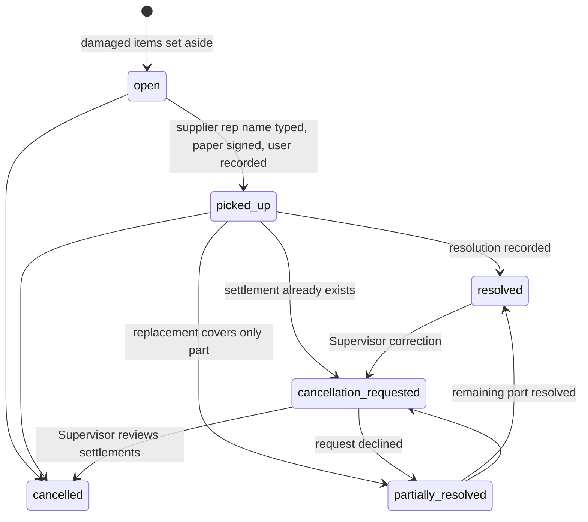

# Workflows and state machines

Each workflow lists states, who can move it, and the side effects. All state changes are audited.

## 1. Invoice

- **draft**: anything not yet submitted. Auto-saves. Allowed without the image/PDF. Listed in a "Drafts" tab like an email client.
- **processing**: AI is reading the file in the background; the worker can leave and come back.
- **needs_review**: AI lines wait for a person. The reviewer must confirm each line, including **date tracking** where the category prompts for it.
- **ready_to_post**: header complete, original file attached, every line confirmed.
- **Posting rules** (all must hold): mandatory header fields present; original file attached; supplier is **confirmed** (a proposed supplier blocks posting with the reason shown as "Waiting for Supervisor to confirm supplier"); every unmatched line resolved (matched or created as a pending new product); worker has answered the same-supplier lower-price questions where they apply.
- **On posting:** create `received` stock movements for physically delivered units only (invoiced units minus missing units, including partial shortages); create price proposals; create alerts; create the invoice entry in this branch's supplier ledger (net of open shorts); lock the invoice. The entire posting is atomic and idempotent.
- A posted invoice can be corrected only by the Supervisor (void and re-enter, or adjustment), with an audit entry and compensating ledger entries. Preview original and later short deliveries, returns/replacements, payments/credits and allocations. Resolve consumed stock and any existing settlements before voiding; prevent an unexplained negative-stock reversal. Preserve immutable originals and links from every reversal/corrected invoice to the original; never delete movements, files, or financial history. Reallocate released payments/credits explicitly and keep any remainder unapplied. Repeated void/post requests cannot duplicate entries. Database migrations still require a verified backup; corrections use normal audited transactions, not destructive database resets.
- Invoice number missing → assign next sequential number for that supplier and mark `number_is_system_assigned`.

## 2. New supplier
Floor Worker quick-adds a supplier (`proposed`) → invoice entry continues → invoice cannot be posted → Supervisor confirms (`confirmed`) or merges it into an existing supplier → invoice becomes postable. Dashboard shows "Supplier waiting for confirmation".

## 3. Price proposal and approval

- Triggers and approval rules are in `requirements.md` §6 and `pricing-engine.md`.
- Check category minimum margin even when calculation returns the current approved price. Below threshold creates an idempotent margin-only review (or adds the reason to a changed-price proposal); ordinary unchanged-price cost changes with no breach need no approval. Invoice posting continues and cashiers keep the approved price. For margin-only review, Supervisor **Keep approved price** with a reason acknowledges the branch's cost/price/configuration context without changing prices/offers, or **Propose manual override** creates a normal pending proposal; defer leaves it pending. Deduplicate pending and acknowledged reviews by company/branch/product/approved price/received unit cost/configuration version, attaching further invoice evidence. Changed context requires a fresh review if still below threshold.
- While `pending`, the Products section shows the proposed price labeled **Pending** next to the approved price. The **cashier lookup keeps showing the last approved price as the price to charge**, with a small "New price pending" tag. A new product with no approved price shows its proposed price tagged "Pending: confirm with a Supervisor before selling". **(assumed)**
- Approval with scope **all branches** (default) sets the company default and archives **every active branch override for that product in that company**, including intentional overrides. Before confirmation show each branch's current → new price, affected offers, and overrides being removed. If a price/override changed since preview, require a refreshed preview before approving. **This branch only** creates/updates that branch's override and leaves every other branch untouched.
- After a price becomes effective, run: offer suggestion check (§7) and cross-branch conflict check (§5).

## 4. Same-supplier lower price (and different-supplier price)
Trigger (at invoice review/posting): the new unit cost is **lower** than the last posted, non-voided receipt cost of the supplier product **in the same company and branch**. Drafts and other branches do not change this comparison. With no prior receipt, there is no lower-cost comparison.
1. Ask the worker: **same expiry date as the stock on hand?**
2. **Yes** → ask: **how many units are left that were bought at the higher cost?**
3. **No** → ask for **both expiry dates** (old stock and new delivery).
4. Alternative answers: **No previous stock** (old units = 0), **Dates not tracked** (no date questions for Rice/Kitchenware), or **Unknown** (note required, including unknown unit counts). Create an alert for the Supervisor with item, branch, supplier, old/new cost and receipts, worker's answers, and invoice link. Unknown information must not be invented and does not block posting once an explicit answer/note is recorded.
5. Supervisor sets **Taken care of** or **Still pending** (can add a note, e.g., "credit requested").

Different supplier at a different price: the item is registered under that supplier (its own supplier name, SKU, pack size) and an alert `other_supplier_price` is raised with both suppliers' latest posted costs in the same branch and their receipt links. Same Taken care of / Still pending actions.
This alert does **not** block posting and is independent of price approval (a cost drop may leave the selling price unchanged).

## 5. Cross-branch price conflict
- Trigger: after any price becomes effective, if a product's effective approved price differs between branches and there is no valid acknowledgment.
- Alert shows the product and each branch's price. Supervisor actions: **Mark as intentional** (stores the exact price pair; stays quiet until either price changes), **Apply price X to all branches**, or leave open.
- Differences are normal (different costs per branch); the alert is an awareness tool, never a blocker.

## 6. Short item

- **open**: deduct only missing quantity's portion of the original invoice line amount and tax; the delivered portion adds stock at posting. Example: 12 chips invoiced, 8 delivered → add 8 stock units; withhold 4 × 1.60 = 6.40 plus 0.83 tax, total 7.23.
- **partially_delivered / resolved_delivered**: record each actual delivery's quantity, time, employee, and document; add just those stock units and restore just their withheld amount. Two later deliveries of 2 chips each restore 3.62 then 3.61, total 7.23, with no extra stock or cents. Cumulative resolved quantity cannot exceed the original missing quantity; retries with the same receipt id cannot duplicate entries.
- Compute each cumulative restored base/tax allocation from the original withheld amount × cumulative delivered quantity ÷ original missing quantity, rounded half-up to cents. The new entry is cumulative allocation minus earlier entries; the last delivery receives the rounding remainder. Capture invoice line tax as posted; do not substitute today's rate. This conserves the original subtotal/tax exactly.
- If a later delivery has a genuinely changed cost/tax, preserve the original withheld allocation and let the Supervisor document a linked price/tax adjustment or new invoice for the difference; do not silently overwrite the original invoice. Run normal price/alert checks on actual received cost.
- **closed_not_delivered**: the deduction for the remaining missing quantity stands; do not add a second credit. Supervisor sees the invoice, delivered resolutions, missing remainder, and closing reason. Reopening or accepting goods after closure requires Supervisor correction with an audit entry.
- The Supervisor dashboard lists open shorts with age.

## 7. Offers and mix-and-match
- Offer definitions map selling price → offer (settings): 1.99 → 3 for $5, 2.99 → 2 for $5, 3.99 → 2 for $7 **(assumed)**.
- **Suggestion:** when a product's price becomes effective at one of those prices and the product has no offer in that scope, create an `offer_suggestion` task for the Floor Worker: **Confirm offer** (also choose whether it joins the mix-and-match pool) or **Dismiss**. No approval is needed after that.
- A product has at most one active offer row per company/branch scope and **one effective offer per branch**. An eligible branch offer takes precedence over an eligible company offer; a company offer applies only when its mapped price equals that branch's effective approved price. Suggestions and labels use the same resolver.
- Any price change ends incompatible offers in the affected scope, including a change to an unmapped price. Create a suggestion only for a matching mapping; require worker confirmation. Clearing overrides during all-branch approval recalculates every branch's offer and does not reactivate previously stopped offers.
- Mix-and-match pools are per **company, branch, currency, and offer definition**, across categories and suppliers within that scope only. No cross-branch/company mixing. Start/end schedules use company business time; eligibility is checked when viewing or applying the offer, not only when a scheduled job runs.
- Workers and Supervisors can also create and stop offers manually; start/end dates are optional.

## 8. Supplier return

- When a supplier arrives and is selected, show that supplier's **open returns** at once so the worker can pick them up.
- Creating return lines moves the damaged/set-aside quantity out of sellable stock (`return_pending`). A recorded original recovery can restore **only confirmed physically present, safe, sellable original units**, before or after pickup, as `return_original_recovered`; cancellation itself creates no movement. Confirm a quantity and condition for each line, including zero. Total restored originals cannot exceed the quantity removed and not already restored. Goods left with the supplier, damaged originals, and received replacements never count as recovered originals.
- Pickup requires the **supplier representative's typed name**, actual picked-up quantities, a signed paper pickup slip, and its scan/photo or retained-original reference. Keep partial pickups and their quantities/evidence; unpicked lines stay at their recorded location. Pickup does not require a new purchase invoice. Item condition photos remain optional. See `return-policy.md`.
- Resolution types: credit on current invoice, credit on a later invoice, replacement product received (fully/partially), cash or other compensation, no compensation, cancelled.
- A return is credited on **one** invoice only, with a supplier credit note/reference. Worker records a claim/evidence; Supervisor verifies it and posts one `credit` entry in the same company's branch/supplier ledger. Block duplicate credit document/posting identifiers. Credits/cash/other financial settlements and their reversals are Supervisor-only.
- **Replacement received** adds stock, records product/qty/date/employee/rep/photo/note, and **never** touches Payables.
- Each settlement records covered original lines/quantities separately from replacement product quantities; do not infer that one substitute unit equals one original unit. Partial settlements leave uncovered quantities open; allocations cannot cover the same original quantity twice. **No compensation** needs a Supervisor reason.
- Workers may cancel an unsettled return with a reason and actual original-stock disposition. After any replacement or financial settlement, cancellation is a request for Supervisor review. Recovery of original goods is a separate recorded physical event; cancellation alone creates no stock. Never automatically remove replacement stock or erase a credit. Supervisor documents returned/retained replacements, retained/reversed compensation, and appends justified stock/ledger reversals linked to originals. Goods already consumed cannot be blindly subtracted. Missing paperwork or a supplier dispute stays flagged until resolved.
- Completed and cancelled returns stay in history and are searchable.

## 9. Date tracking and expiry
- Entry created when the reviewer confirms date tracking on an invoice line (Grocery and Grocery (Taxable) prompt; Rice and Kitchenware do not).
- "Expiring soon": date within the configured days (default 30). "Expired": date in the past, shown in red.
- Because there are no sales yet, the entry stays `active` until someone presses **Cleared** (removed, sold out, or checked).
- The list can be filtered by branch, AI category, and time window.

## 10. Label printing
1. Choose products (search or filter by AI category); optionally set copies.
2. Choose a saved **template**; or create one (name, width, height, margins, gaps).
3. The app calculates how many labels fit on an A4 sheet: `columns = floor((210 − left − right + gap_x) / (width + gap_x))`, `rows` likewise with 297; slots are numbered left-to-right, top-to-bottom (a setting allows right-to-left for Persian layouts).
4. Choose the **starting slot** (for a partially used sheet).
5. Preview the PDF; print. Content per label comes from `arzon-config.json` → `labels.show`.
No label queue and no automatic label creation after approvals.

## 11. Payables (Supervisor)
- Balance per **branch and supplier** = opening balance + invoices (net of open shorts) − credits − payments ± adjustments.
- Partial payments allowed; each payment can carry a cheque number and payment date; entries can be flagged **disputed** with a note.
- Allocate payments/credits to specific open invoices in the same company, branch, supplier, and currency. Preview oldest due date first, then invoice date/id; Supervisor may edit allocations. Each allocation is capped at the invoice's outstanding amount and the payment/credit's available amount. Any excess remains unapplied supplier credit, never a fictitious negative invoice.
- Invoice outstanding = posted net payable + later short restorations/adjustments − active credit/payment allocations. Due dates apply to invoices with a positive outstanding amount; undated invoices remain open but are not called overdue. Net supplier balance = outstanding invoice debits + unallocated opening/adjustment debits − unapplied credits/payments. These figures reconcile to the signed ledger; invoice totals, credit rows, and allocations must not be counted twice.
- Reversals append linked entries and allocation reversals; the original payment/credit remains visible. Currency changes cannot reinterpret old entries. Refunds/returned cheques are Supervisor corrections with evidence and reasons.
- A month-end summary per supplier (printable, CSV) lists open invoices, credits, payments, and the balance.
- No QuickBooks integration now. Keep the export format simple and stable.

## 12. Stock counts
A worker selects a product, enters the counted quantity; the app shows expected vs counted, creates an `adjustment` movement for the difference, and logs it. Large variances appear in the Supervisor activity view **(threshold is a setting; default off)**.

## 13. Session and device
- Registered device: PIN sign-in by choosing a name.
- Idle lock after N minutes: screen locks and requires the PIN again; no actions are possible while locked.
- Sensitive actions (approve, payables, settings, users) re-prompt for the full password if the last password entry is older than a short window **(assumed: 15 minutes)**.
